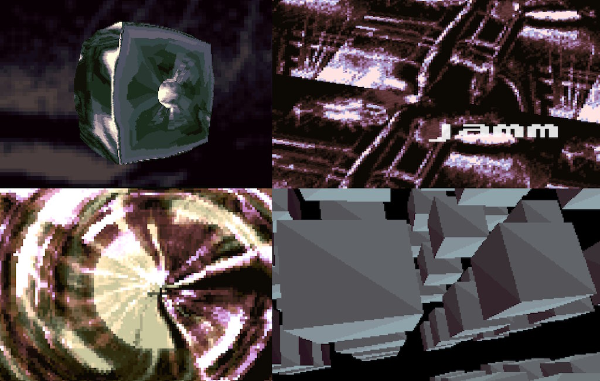

# Nation Zero

Jamm · 64k intro · The Assembly 1995

- Code: Galvados
- Gfx, palettes: Visualize, Criman
- Music: Dune

Production: https://www.pouet.net/prod.php?which=1366

Watch it here: https://kdrapel.github.io/jamm-nation0/

## Run on Windows

Double-click **Start.cmd**. It opens the intro in your browser. Keep the small
server window open while watching; close it when you are finished.
No installation or npm packages are needed.

Alternatively, with Node.js installed, run `node server.mjs` and open
http://localhost:8080. The folder can also be uploaded to a static web host.
Use a current Chrome, Edge, Firefox or Safari browser. Opening index.html directly
as a file does not work because browsers block loading the intro's local assets.

## Controls

- Space: play or pause
- Left / right: seek ten seconds
- F: fullscreen
- Esc: stop and return to the title
- The playback bar also provides pause, stop, seeking and fullscreen.

## Links

The entry page links to four interactive explanations in **effects-explained**:
whirlpool, wire mesh, voxel and cube morph. Each includes controls, source links and
navigation back to the intro. They work locally without external font downloads.

## Contents

The original executable, required translated runtime modules, and reusable,
losslessly compressed 15-second video/audio segments are included. The segments
were generated by one full run of the translated intro; they provide immediate
navigation without replaying startup. They contain no reference screenshots.
The runtime remains available as a fallback if the segment manifest is missing.
The title font and green voxel background come from Nation Zero itself.

## Migration
Disassembly from unpacked executable with IDA.
GPT models were used to reverse-engineer it and port to JS.
- Luna (med/high): did most of the dirty job
- Terra (med): for more difficult routines and tasks
- Sol (low): for fine-tuning and tricky bugs
  
ChatGPT (Sol) was used to generate good instructions and steer the agents.
The reference was crafted based on the approach of MrDoob with
- Unicorn (to validate functions)
- DosBox-X, I modified it to generate a full memory dump, registers, VGA state every N frames
- the sound (.mod) was converted to .wav

Agents used the images as reference to validate the generated content. The sound was verified against the .wav by checking mismatch at the wave level and also spectrum level.
